# 📊 Spotify Backend - Flow Diagrams

## 1. Application Request Flow

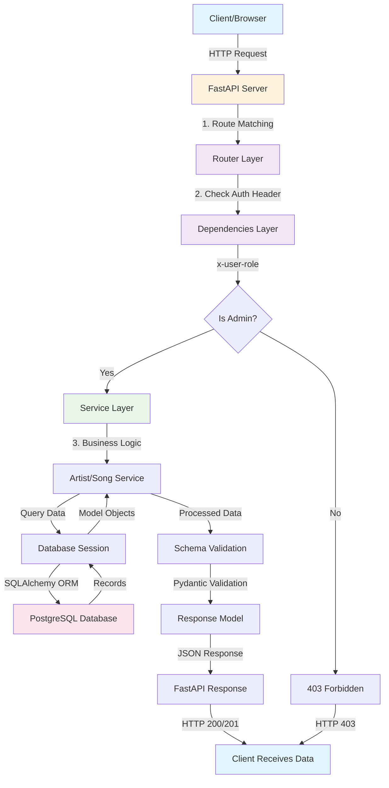

---

## 2. Application Architecture Layers

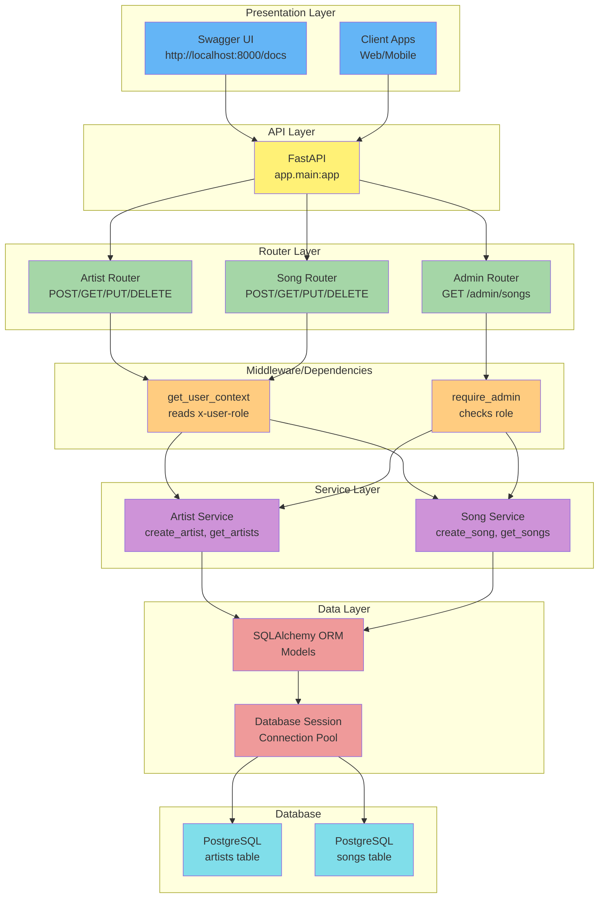

---

## 3. Database Schema Relationship

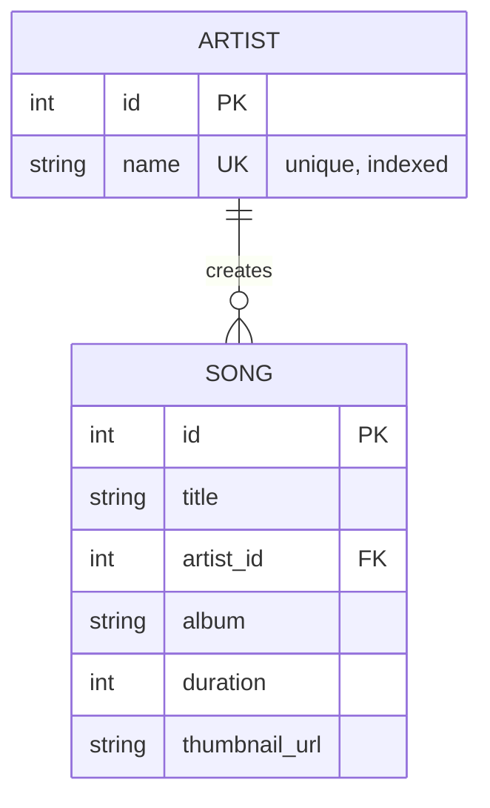

---

## 4. Complete Request Sequence: Create Song (Admin)

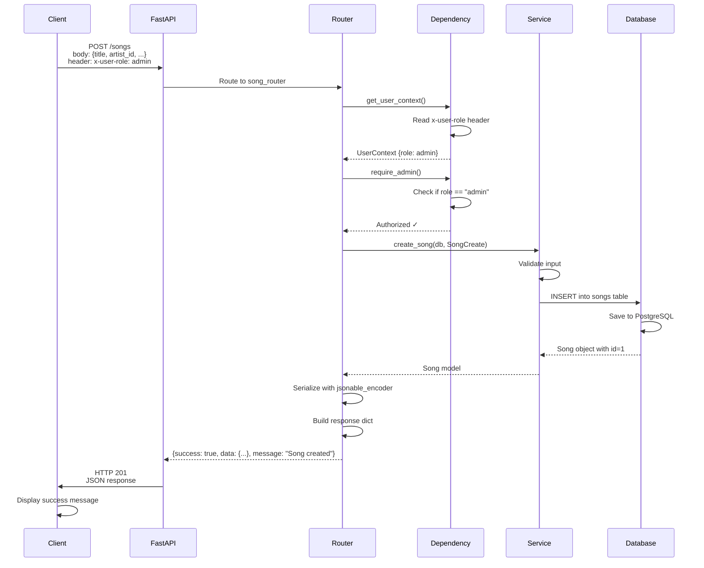

---

## 5. Authorization Flow

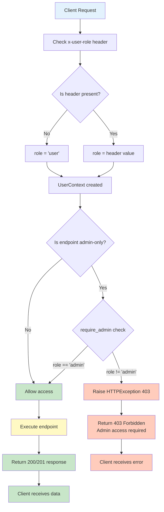

---

## 6. Admin Request Flow Diagram

```mermaid
graph TD
    A["🔐 Admin Client"] -->|HTTP Request<br/>header: x-user-role: admin| B["FastAPI Server"]
    B -->|Route Matching| C["Admin Check"]
    C -->|require_admin()| D{Is Admin?}
    
    D -->|Yes ✓| E["Service Layer"]
    D -->|No ✗| F["❌ HTTP 403<br/>Admin access required"]
    
    E -->|Full Access| E1["✅ Create Artist"]
    E -->|Full Access| E2["✅ Update Artist"]
    E -->|Full Access| E3["✅ Delete Artist"]
    E -->|Full Access| E4["✅ Create Song"]
    E -->|Full Access| E5["✅ Update Song"]
    E -->|Full Access| E6["✅ Delete Song"]
    E -->|Full Access| E7["✅ View Admin Dashboard"]
    
    E1 -->|Modify DB| DB[(PostgreSQL<br/>artists table)]
    E2 -->|Modify DB| DB
    E3 -->|Modify DB| DB
    E4 -->|Modify DB| DB2[(PostgreSQL<br/>songs table)]
    E5 -->|Modify DB| DB2
    E6 -->|Modify DB| DB2
    E7 -->|Read DB| DB
    E7 -->|Read DB| DB2
    
    DB -->|Success| RESP["✅ HTTP 200/201<br/>Changes Applied"]
    DB2 -->|Success| RESP
    
    RESP -->|Response| A
    F -->|Response| A
    
    style A fill:#d32f2f,color:#fff
    style B fill:#1565c0,color:#fff
    style C fill:#0277bd,color:#fff
    style D fill:#00796b,color:#fff
    style E1 fill:#2e7d32,color:#fff
    style E2 fill:#2e7d32,color:#fff
    style E3 fill:#c62828,color:#fff
    style E4 fill:#2e7d32,color:#fff
    style E5 fill:#2e7d32,color:#fff
    style E6 fill:#c62828,color:#fff
    style E7 fill:#1976d2,color:#fff
    style F fill:#c62828,color:#fff
    style DB fill:#1565c0,color:#fff
    style RESP fill:#2e7d32,color:#fff
```

---

## 7. User Request Flow Diagram

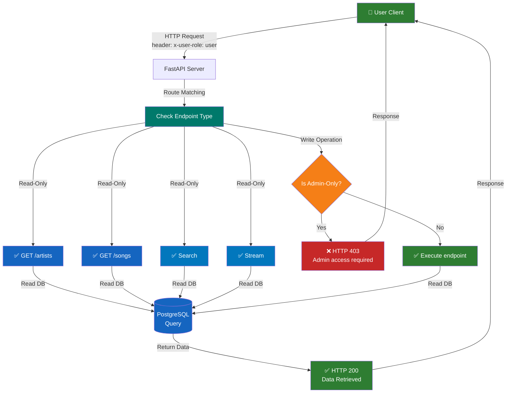

---

## 8. Admin Complete Workflow

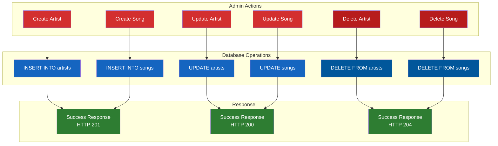

---

## 9. User Complete Workflow

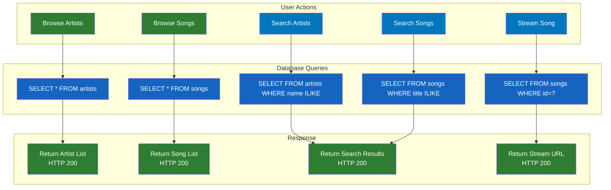

---

## 📌 How to View These Diagrams

1. **GitHub:** If you push this to GitHub, Mermaid diagrams render automatically
2. **VS Code:** Install "Markdown Preview Mermaid Support" extension
3. **Online:** Copy any diagram code to [mermaid.live](https://mermaid.live)

## 10. Use Case Diagram - Admin Role

```mermaid
graph TB
    subgraph "Admin User"
        Admin["🔐 Admin User"]
    end
    
    subgraph "Artist Management"
        A1["View All Artists"]
        A2["Create Artist"]
        A3["Update Artist"]
        A4["Delete Artist"]
        A5["Search Artist"]
    end
    
    subgraph "Song Management"
        S1["View All Songs"]
        S2["Create Song"]
        S3["Update Song"]
        S4["Delete Song"]
        S5["Search Song"]
        S6["Stream Song"]
    end
    
    subgraph "Admin Dashboard"
        D1["View Admin Songs"]
        D2["Monitor All Activities"]
    end
    
    Admin --> A1
    Admin --> A2
    Admin --> A3
    Admin --> A4
    Admin --> A5
    Admin --> S1
    Admin --> S2
    Admin --> S3
    Admin --> S4
    Admin --> S5
    Admin --> S6
    Admin --> D1
    Admin --> D2
    
    style Admin fill:#d32f2f,color:#fff
    style A2 fill:#d32f2f,color:#fff
    style A3 fill:#d32f2f,color:#fff
    style A4 fill:#b71c1c,color:#fff
    style S2 fill:#d32f2f,color:#fff
    style S3 fill:#d32f2f,color:#fff
    style S4 fill:#b71c1c,color:#fff
    style D1 fill:#1565c0,color:#fff
    style D2 fill:#1565c0,color:#fff
```

---

## 11. Use Case Diagram - User Role

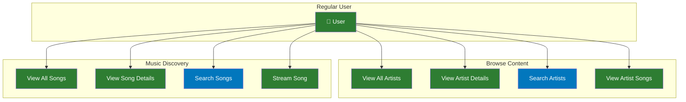

---

## 12. Use Case Diagram - Combined (Admin & User)

```mermaid
graph TB
    subgraph "Actors"
        Admin["🔐 Admin User"]
        User["👤 Regular User"]
    end
    
    subgraph "Artist Operations"
        UC1["View All Artists"]
        UC2["Create Artist<br/>ADMIN ONLY"]
        UC3["Update Artist<br/>ADMIN ONLY"]
        UC4["Delete Artist<br/>ADMIN ONLY"]
        UC5["Search Artists"]
        UC6["Get Artist Songs"]
    end
    
    subgraph "Song Operations"
        UC7["View All Songs"]
        UC8["Create Song<br/>ADMIN ONLY"]
        UC9["Update Song<br/>ADMIN ONLY"]
        UC10["Delete Song<br/>ADMIN ONLY"]
        UC11["Search Songs"]
        UC12["Stream Song"]
    end
    
    subgraph "Admin Only"
        UC13["Admin Dashboard"]
    end
    
    Admin --> UC1
    Admin --> UC2
    Admin --> UC3
    Admin --> UC4
    Admin --> UC5
    Admin --> UC6
    Admin --> UC7
    Admin --> UC8
    Admin --> UC9
    Admin --> UC10
    Admin --> UC11
    Admin --> UC12
    Admin --> UC13
    
    User --> UC1
    User --> UC5
    User --> UC6
    User --> UC7
    User --> UC11
    User --> UC12
    
    style Admin fill:#ffccbc
    style User fill:#c8e6c9
    
    style UC1 fill:#fff9c4
    style UC5 fill:#fff9c4
    style UC6 fill:#fff9c4
    style UC7 fill:#fff9c4
    style UC11 fill:#fff9c4
    style UC12 fill:#fff9c4
    
    style UC2 fill:#ffab91
    style UC3 fill:#ffab91
    style UC4 fill:#ff8a65
    style UC8 fill:#ffab91
    style UC9 fill:#ffab91
    style UC10 fill:#ff8a65
    style UC13 fill:#ffab91
```

---

## 📊 Use Case Summary Table

| Feature | Admin | User |
|---------|-------|------|
| **View Artists** | ✅ | ✅ |
| **Search Artists** | ✅ | ✅ |
| **Create Artist** | ✅ ONLY | ❌ |
| **Update Artist** | ✅ ONLY | ❌ |
| **Delete Artist** | ✅ ONLY | ❌ |
| **View Songs** | ✅ | ✅ |
| **Search Songs** | ✅ | ✅ |
| **Stream Song** | ✅ | ✅ |
| **Create Song** | ✅ ONLY | ❌ |
| **Update Song** | ✅ ONLY | ❌ |
| **Delete Song** | ✅ ONLY | ❌ |
| **Admin Dashboard** | ✅ ONLY | ❌ |

---

## 🎯 What Each Diagram Shows

- **Diagram 1:** How data flows through the entire application
- **Diagram 2:** The layered architecture and component relationships
- **Diagram 3:** Database table relationships
- **Diagram 4:** Step-by-step flow of a create request
- **Diagram 5:** Authorization and role-checking logic
- **Diagram 6:** Admin complete request flow and all accessible endpoints
- **Diagram 7:** User complete request flow and read-only operations
- **Diagram 8:** Admin workflow with all create/update/delete operations
- **Diagram 9:** User workflow with browse/search/stream operations
- **Diagram 10:** Admin use cases and capabilities
- **Diagram 11:** User use cases and capabilities
- **Diagram 12:** Combined view showing differences between admin and user roles
- **Table:** Quick reference for role-based access control
